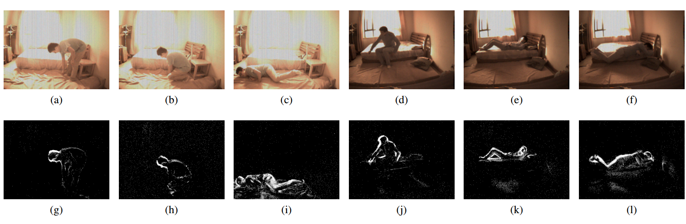
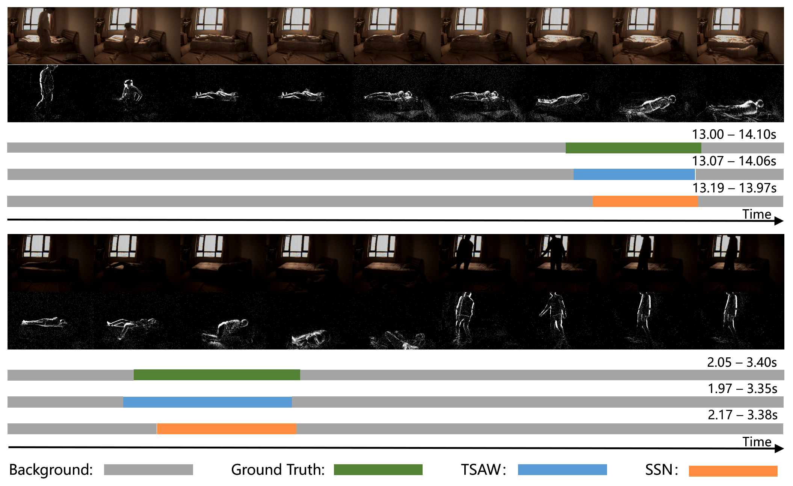

## Neuromorphic Vision based Fall Localization in Event Streams with Temporal Spatial Attention Weighted Network

This repository contains the  codes and Dataset in our paper "Neuromorphic Vision based Fall Localization in Event Streams with Temporal Spatial Attention Weighted Network" .

### Paper

Please cite our paper if you feel our dataset or our codes useful to  your research.

### Abstract

Falling down is a serious problem for health and has become one of the major etiologies of accidental death for the elderly living alone. In recent years, many efforts have been paid to falls recognition based on wearable sensors or standard vision sensors. However, the prior methods have the risk of privacy leaks, and almost all these methods are based on video clips, which cannot localize where the falls occurred in long videos. For these reasons, in this paper, the bio-inspired vision sensor based falls temporal localization framework is proposed. The bio-inspired vision sensors such as DAVIS camera applied in this work responds to pixels' brightness change, and each pixel works independently and asynchronously compared with the standard vision sensors. This property makes it have a very high dynamic range and privacy-preserving. Firstly, to better represent event data, compared with the typical constant temporal window mechanism,an adaptive temporal window conversion mechanism is developed. And the temporal localization framework follows a proven ***"proposal and classification"*** paradigm. Secondly, for the high efficient and recall proposal generation, different from the traditional sliding window scheme, the event temporal density as the actionness score is set and the 1D-watershed algorithm to generate proposals is applied. In addition, we combine the temporal and spatial attention mechanism with our feature extraction network to temporally model the falls. Finally, to evaluate the performance of our framework, 30 volunteers are recruited to join the simulated falls experiments. According to the results of experiments, our framework can realize precise falls temporal localization and achieve the state of the art performance.

### Demo

Fig.1: Examples of our recorded event camera-based fall temporal detection dataset

Fig.2:  Qualitative falling down action detection results on our event camera-based dataset at
different light conditions.

### Dataset And Codes Release

The dataset and codes  will be available after our paper is accepted.